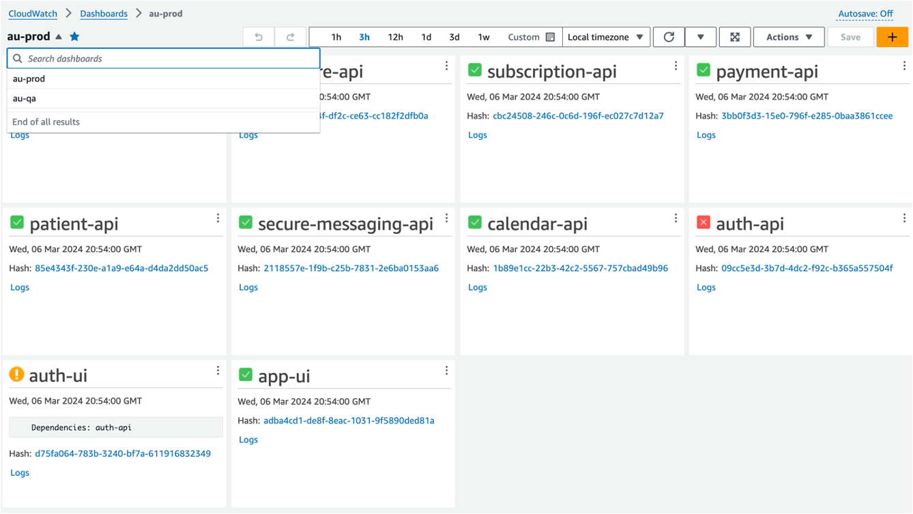

<p align="center">
  <a href="" rel="noopener">
 </a>
</p>

<h3 align="center">Deployment Observability Dashboard</h3>

<div align="center">

[]()
[](https://github.com/coreplus-app/observability-lambda/issues)
[](https://github.com/coreplus-app/observability-lambda/pulls)
[](/LICENSE)

</div>

---

<p align="center"> Automate Deployment Observability using AWS CloudWatch Dashboards (for almost any pipeline)
    <br> 
</p>

## 📝 Table of Contents

- [📝 Table of Contents](#-table-of-contents)
- [About ](#about-)
- [Lambda Usage \& Configuration ](#lambda-usage--configuration-)
- [Pipeline Configuration ](#pipeline-configuration-)
- [Authors ](#authors-)

## About <a name = "about"></a>

If you have multiple pipelines deploying multiple services in multiple regions, then there's a good chance you're a victim to deployment observability fragmentation.

Deployment observability fragmentation contributes towards developer cognitive overhead and detracts from developer productivity.

Wouldn't it be nice if you could see what version of a service is deployed in each region and environment - regardless of what pipeline deployed it?

This solution aims to solve this problem in a very simply and effective way, using a simple Lambda AWS function with CloudWatch.

To date, there are no easy and effective ways to create this level of observability without implementing a full blown logging solution, or, rebuilding all your CI/CD deployments into a new singular pipeline.

This Lambda function will automatically generate CloudWatch Dashboards and Widgets, per region and environment.

Below is an example of a generated CloudWatch Dashboard for au-prod and au-qa.



Green tick === Deployment was successful

Red cross === Deployment failed

Orange warning === Deployment was successful, but a service dependancy failed.

## Lambda Usage & Configuration <a name="usage"></a>

Once you've deployed this Lambda function, attach a trigger to a CloudWatch log stream, so the function will execute each time the log stream is written to. This is the same log stream where all your CI/CD pipelines will push logs to.

To build the deployment package, run the following command, to produce a deployable zip file.
```
npm run build
```

## Pipeline Configuration <a name="usage"></a>

If your pipeline supports the [aws-cli](https://github.com/aws/aws-cli/tree/v2) then you can surface that pipelines deployment observability into CloudWatch. 

In the `post-build` or `after-script` section of your yaml files, add the following reference:

```
after-script:
  - ./scripts/log.sh $BUILD_STEP_NAME
``` 

Log.sh:
```
#!/bin/bash
set -e

BUILD_STEP_NAME=$1

DIR="$(cd "$(dirname "$0")" && pwd)"
# source color vars
. $DIR/console.sh

TIMESTAMP=$(($(date +%s%N)/1000000)) && \
aws logs put-log-events \
  --log-group-name deployments \
  --log-stream-name logs \
  --log-events '[{
    "timestamp": '"$TIMESTAMP"',
    "message": "{\"app\": \"'"$BUILD_APP_NAME"'\", \"time_stamp\": '"$TIMESTAMP"', \"git_commit_hash\": \"'"$BITBUCKET_COMMIT"'\", \"pipeline_id\": \"'"$BITBUCKET_PIPELINE_UUID"'\", \"repo_id\": \"'"$BITBUCKET_REPO_UUID"'\", \"repo_name\": \"'"$BITBUCKET_REPO_FULL_NAME"'\", \"build_step\": \"'"$BUILD_STEP_NAME"'\", \"build_number\": \"'"$BITBUCKET_BUILD_NUMBER"'\", \"build_exit_code\": \"'"$BUILD_EXIT_CODE"'\", \"region\": \"'"$CDK_REGION"'\", \"env\": \"'"$CDK_ENV"'\", \"deployments_url\": \"'"$BITBUCKET_GIT_HTTP_ORIGIN"'/deployments\"}"
  }]'
```

Note: The variables above are referenced from BitBucket Pipelines environment variables. Be sure to use the supported environment variables of your pipeline.

This will create a log in in the defined log group and stream.

## Authors <a name = "authors"></a>

- [@mark_pirotta](https://github.com/mark_pirotta) - Idea & Initial work
- [@MirandaDora](https://github.com/MirandaDora) - Expansion on the initial work, and taking this internally to Amazon.

See also the list of [contributors](https://github.com/coreplus-app/observability-lambda/contributors) who participated in this project.

